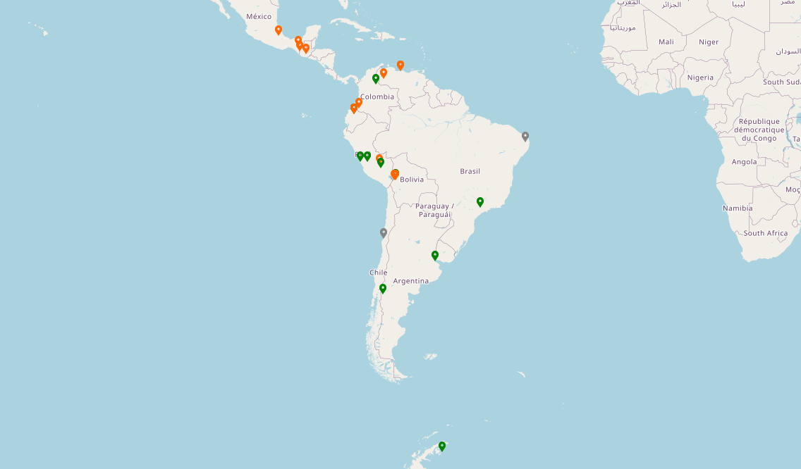

# LAGO sites

The LAGO projects has detectors in many different sites:

- Mount Chacaltaya (Bolivia)
- Sierra Negra (Mexico)
- Pico Espejo (Venezuela)
- Marcapomacocha (Peru)
- And low altitude detectors in Argentina, Colombia, Guatemala and Ecuador

## Geographical Distribution and Altitudes of LAGO Water Cherenkov Detectors

## Chacaltaya

Mount Chacaltaya, close to La Paz, in Bolivia, is the highest altitude cosmic ray laboratory, at 5300 m above sea level.

Being the highest site for LAGO, it is the one with the best signal from GRB. Interestingly enough, being very close to the magnetic equator, it might have a background quite low for such a high altitude.

A prototype detector is currently at the Chacaltaya site, and two large 4 m2 are being calibrated.

## Sierra Negra

Sierra Negra, close to Puebla, Mexico, is the first high altitude site in operation in LAGO, with its 4600 m above sea level. It has two small 1 m2 WCD and three bigger 4 m2 WCD in operation.

The array is taking data since January 2007, providing the first LAGO data.

## Pico Espejo

The Pico Espejo cable car is the world's highest cable car. Its base is located in the Venezuelan city of Mérida at an altitude of 1640 meters, and its terminus is on Pico Espejo, at 4765 meters.

A prototype WCD is taking data at the Universidad de Los Andes. Three 4 m2 WCD have been deployed at the Pico Espejo station, but they still lack water and instrumentation.

## Peru

Various sites are under investigation in Peru, and the first detector is operating at Marcapomacocha, 4450m asl. The overall high altitude makes many regions possible extra sites for LAGO.

Prototypes are running both in Cusco and Lima.

## Auger Site

The Pierre Auger Observatory is located in Malargüe, in the south of the Mendoza province, in Argentina.

The aim of the observatory is to detect Ultra High Energy Cosmic Rays (UHECR), and more about its science can be found at the main website of the project.

Since Auger is a huge project, with 1600 10 m2 WCD, it presents an interesting water area to detect GRBs. Its low altitude (1400 m a.s.l.), necesary for the UHECR physics, is however a weakness for GRB detection, reducing its efficiency to one similar to the other sites.

While Auger is not a LAGO site, many scientists from LAGO are also part of Auger (and actually LAGO was born from Auger), so some data analysis is done in common.

Data is being taken since March 2005 and is regularly analyzed.