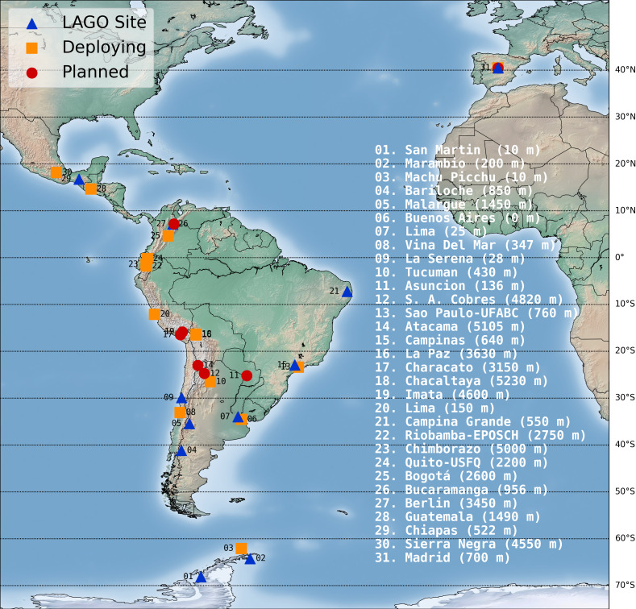
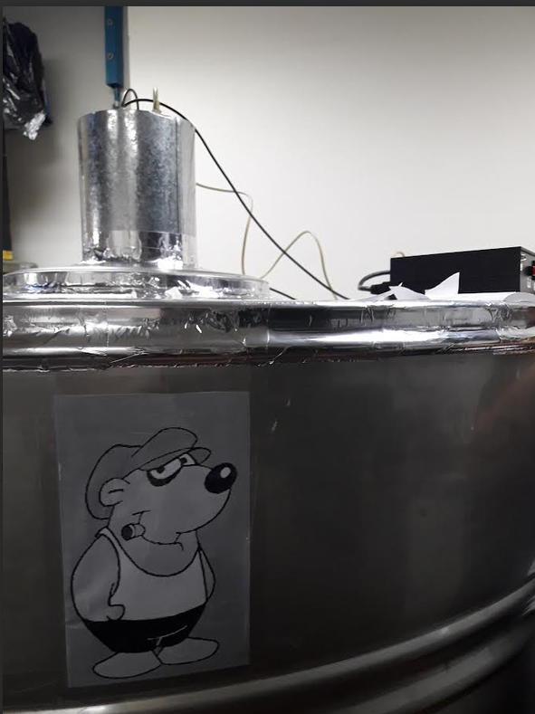
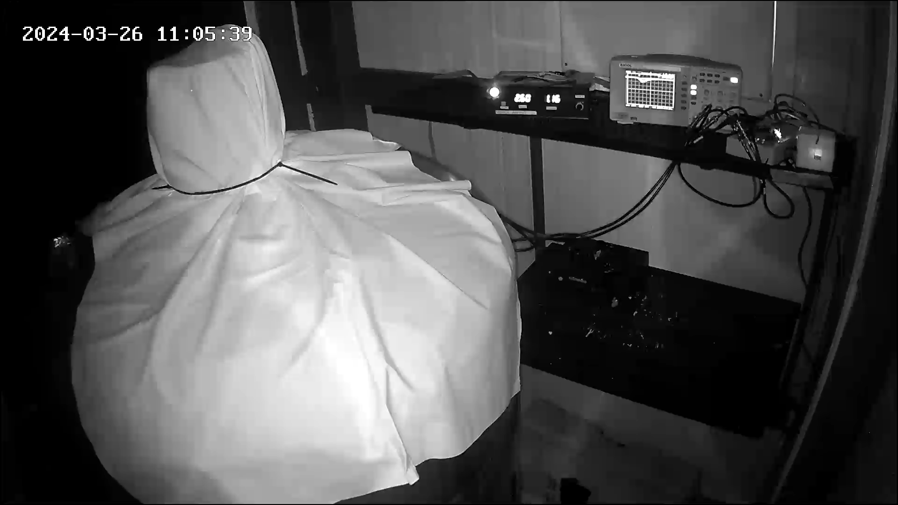
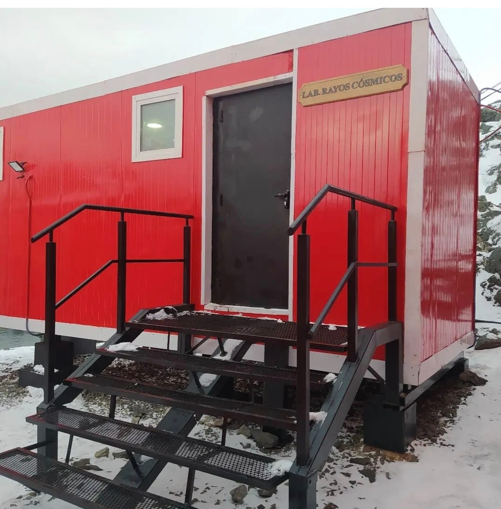
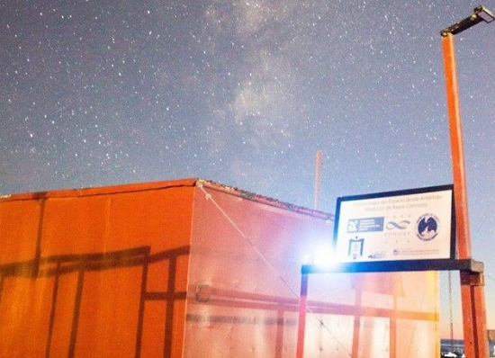

# LAGO sites

The LAGO project has detectors distributed across Latin America, from Mexico to the Antarctic region and from sea level to more than 5000 m above sea level. This broad geographic coverage allows the observatory to study cosmic rays, space weather and atmospheric radiation under very different geomagnetic and atmospheric conditions.

## Geographical distribution

## Sites

??? info "LAMP inter-institutional center formed by (IAFE-IAA-DCAO), Argentina"

	Buenos Aires node at IAFE (Institute for Astronomy and Space Physics) "Pucho" is operating for testing and development.(LAMP instrument)

    

	Argentine Cosmic rays detector (LAMP instrument) in Antarctica (under the Polar Circle) "Neurus II" San Martin Station 68°07′48″S 67°06′09″W 
    Rigidity cut off: 1.69 GV 
    Temporal resolution: 1 hour
    Low level threshold: 3% 
    Moderate level threshold: 4%
    (continuous measurements since 2024) 

    

    *Out side view of the Laboratory*

    

    Argentine Cosmic rays detector (LAMP instrument) in Antarctica over the polar circle. "Neurus I" Marambio Station 64°14′S 56°38′W 
    Rigidity cut off: 2.1 GV
    200 m asl 
    Temporal resolution: 1 hour
    Low level threshold: 3% 
    Moderate level threshold: 4%
    (continuous measurements since 2019)

    

    First Antarctic node: from left to right Dr. Sergio Dasso, Tech. Omar Areso, Ing Matias Pereira, Dra. Adriana M. Gulisano

    *Outside view of the Laboratory.*

    

	Auger is not a LAGO site, but many LAGO scientists also participate in Auger. LAGO was born from Auger, so some data analysis is carried out jointly. Data has been collected since March 2005 and is regularly analyzed.

??? info "Chacaltaya, Bolivia"

	Mount Chacaltaya, close to La Paz, is the highest-altitude cosmic-ray laboratory, at 5300 m above sea level.

	Being the highest site for LAGO, it provides the best signal from GRBs. Its proximity to the magnetic equator may also result in a relatively low background for such a high-altitude site.

	A prototype detector is currently at Chacaltaya, and two large 4 m2 detectors are being calibrated.

??? info "Sierra Negra, Mexico"

	Sierra Negra, close to Puebla, is the first high-altitude LAGO site in operation, at 4600 m above sea level. It has two small 1 m2 WCDs and three larger 4 m2 WCDs in operation.

	The array has been taking data since January 2007, providing the first LAGO data.

??? info "Pico Espejo, Venezuela"

	The Pico Espejo cable car is the world's highest cable car. Its base is in Mérida, at an altitude of 1640 m, and its terminus is on Pico Espejo, at 4765 m.

	A prototype WCD is taking data at the Universidad de Los Andes. Three 4 m2 WCDs have been deployed at the Pico Espejo station, but they still lack water and instrumentation.

??? info "Peru"

	Various sites are under investigation in Peru. The first detector is operating at Marcapomacocha, at 4450 m above sea level. The overall high altitude makes many regions possible additional sites for LAGO.

	Prototypes are running both in Cusco and Lima.

??? info "Auger site, Argentina"

	The Pierre Auger Observatory is located in Malargüe, in the south of Mendoza province. Its aim is to detect ultra-high-energy cosmic rays (UHECR).

	With 1600 10 m2 WCDs, Auger provides a large water area for detecting GRBs. Its low altitude, 1400 m above sea level, is a weakness for GRB detection and reduces its efficiency to a level similar to the other sites.

	Auger is not a LAGO site, but many LAGO scientists also participate in Auger. LAGO was born from Auger, so some data analysis is carried out jointly. Data has been collected since March 2005 and is regularly analyzed.

