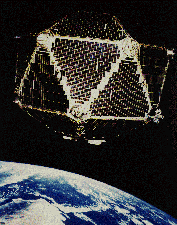
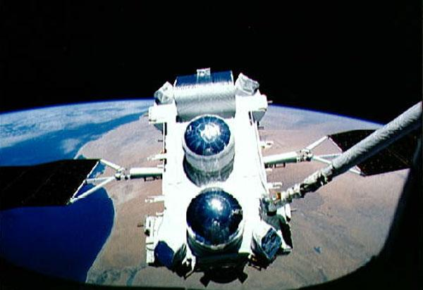
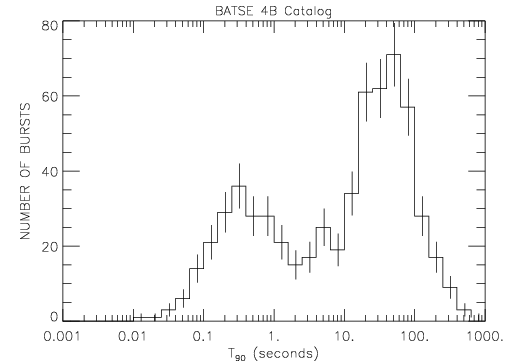
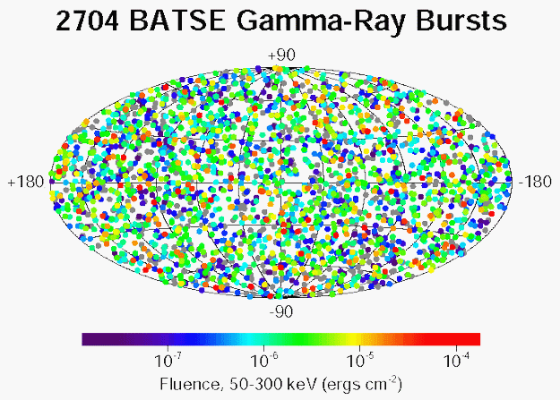
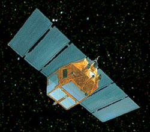
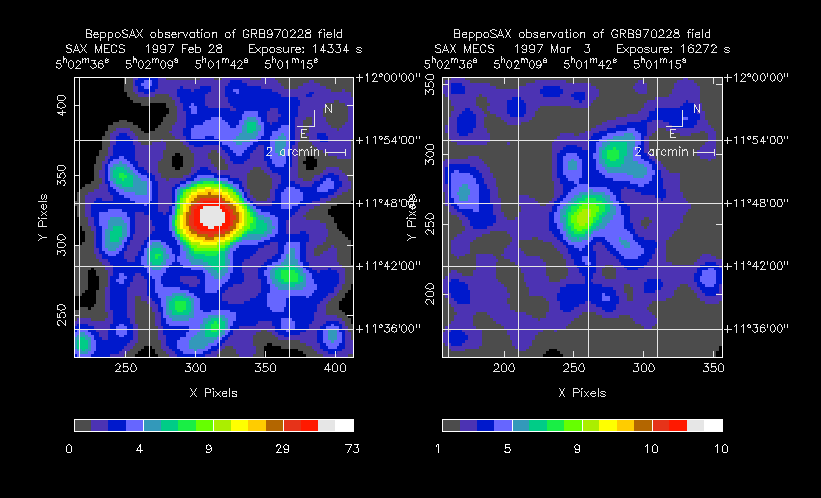
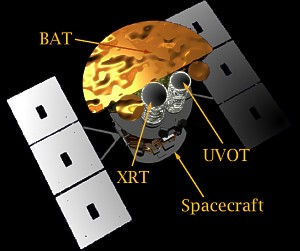
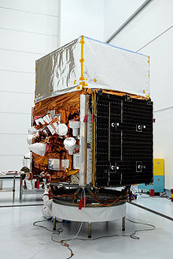

# Gamma Ray Bursts

## Vela 5: discovering GRBs

The Gamma Ray Bursts (GRB) were discovered accidentaly in the 60's by US military satellites in search of non authorized nuclear explosions.

The Vela 5 satellites promptly detected gamma ray bursts similar to what they would expect from such explosions, but coming from space.

These bursts where short, from 0.01 to about 100 s, and had most of their energy carried by photons above 100 keV.

They remained mysteries for more than 30 years.

## BATSE: 1991-2000

In 1991, BATSE (Burst And Transient Source Experiment) was sent in space, and started providing very valuable data on GRBs. With its 8 modules, it was able to see the whole sky, and detected about 1 GRB per day.

BATSE clearly saw 2 distinct populations of bursts, short and long, but except for their duration, no significant diferences were found, due to the lack of additional data.

>Time distribution of BATSE GRBs: 2 populations are clearly visible: short (<2 s) and long (>2 s) bursts 

Another important discovery of BATSE is that GRBs are isotropic, as can be seen on the picture above. They is no correlation with our galactic plane, as one would expect if these GRBs are from galactic origin. Furthermore, BATSE saw a deficit on low luminosity (energy) GRBs, indicating that GRBs are either located in galaxy halos, or are from cosmologic origin (in which case the deficit at low energy would be due to the expansion of the universe).

> Map of arrival of BATSE bursts (in galactic coordinates) 

## Beppo-SAX: 1996-2002

Beppo-SAX made some further discoveries possible due to its good angular resolution. While BATSE had about 4 degrees pixels, Beppo-SAX reached about 50" (i.e. 290 times better). It had on board, in addition to a GRB monitor, various X-ray detectors (lower energy than gamma).

On February 28th of 1997, Beppo-SAX saw a burst both with its Gamma Ray detector and X-ray. It observed the burst during a few days and saw an afterglow in X: the X-ray image became dimmer on timescales of days.

> GRB 970228 in X-ray: Left: on February 28th,Right: 3 days later 

3 months later, GRB 970508 was detected by Beppo-SAX and ground-based spectrometers were able to mesure the optical spectrum of the afterglow. This allowed to measure the redshift of the object: z~0.84. It was the confirmation that GRBs were cosmologicals.

However, this discovery posed a new problem. If GRBs were so distant, then they had to be incredibly powerful: about 1051 to 1054 ergs, the light of a billion galaxies!

## SWIFT: 2004-

SWIFT provided an important discovery: while afterglows had been observed only in long bursts initially, SWIFT allowed a prompt localization of bursts, and optical counterparts of short bursts were observed.

This, combined with correlations of long bursts with supernovae, allowed some confidence on the origin of the GRBs, after more than 30 years since their discovery.

## Fermi: 2008-

Fermi has been a game changer in the high energy domain of gamma ray observation. It has observed many GeV photons from GRBs, but even its huge LAT detector has not yet been able to determine the maximum energy of a GRB, due to the low fluences involved. Maybe ground based experiments, such as LAGO or HAWC in Mexico, will be able to contribute in this field. 

## GRB Theory

Long GRBs are usually considered as coming from hypernovae, a kind of supernova originated by super-massive star (>40 solar masses).

Short GRBs are probably produced by the coalescence of compact objects (neutron star or black hole) in a binary system.

A mecanism that could explain the formation in both cases is the fireball model, where a highly relativistic fireball produces the gammas of the burst in internal shocks, while the afterglow is produced when the shock wave reaches the local medium.